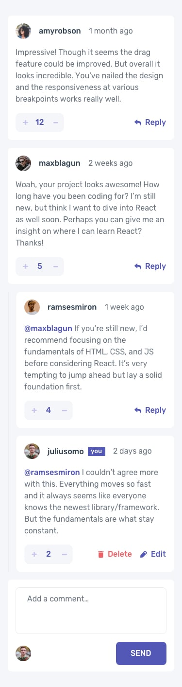

# Interactive Comments Section

A dynamic and responsive comment section built with Vue 3, TypeScript, and Tailwind CSS. This application allows users to interact with comments through various actions while maintaining a clean and modern user interface.




## Features

- **Full CRUD Operations**
  - Create new comments and replies
  - Read existing comments and their nested replies
  - Update your own comments and replies
  - Delete comments you've created

- **Voting System**
  - Upvote and downvote comments
  - Real-time vote count updates

- **Responsive Design**
  - Mobile-first approach
  - Optimized layout for all screen sizes
  - Smooth transitions and hover states

- **Data Persistence**
  - Local storage implementation
  - State persists across browser refreshes

## Tech Stack

- **Frontend Framework:** Vue 3
- **Type Safety:** TypeScript
- **Styling:** Tailwind CSS
- **Build Tool:** Vite
- **Package Manager:** pnpm
- **Code Quality:**
  - ESLint for linting
  - Prettier for code formatting

## Getting Started

### Prerequisites

- Node.js (v18 or higher recommended)
- pnpm package manager

### Installation

1. Clone the repository
```bash
git clone [your-repo-url]
cd interactive-comment-section
```

2. Install dependencies
```bash
pnpm install
```

3. Start the development server
```bash
pnpm dev
```

4. Build for production
```bash
pnpm build
```

## Development Scripts

- `pnpm dev` - Start development server
- `pnpm build` - Build for production
- `pnpm preview` - Preview production build
- `pnpm lint` - Run ESLint
- `pnpm format` - Format code with Prettier

## Project Structure

```
interactive-comment-section/
├── src/
│   ├── components/     # Vue components
│   ├── assets/        # Static assets
│   ├── App.vue        # Root component
│   └── main.ts        # Application entry point
├── public/            # Public static files
└── [config files]     # Various configuration files
```

## Mobile-First Approach

The application is designed with a mobile-first methodology, ensuring a seamless experience across all devices. The interface adapts smoothly to different screen sizes while maintaining functionality and user experience.

## Future Enhancements

- [ ] Backend integration for persistent data storage
- [ ] User authentication system
- [ ] Real-time comment updates
- [ ] Comment moderation features
- [ ] Rich text formatting support

## Contributing

Contributions are welcome! Please feel free to submit a Pull Request.

## License

This project is open source and available under the [MIT License](LICENSE).
